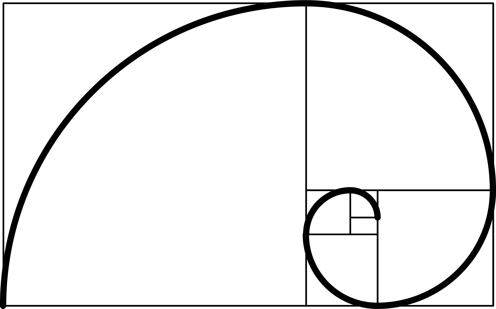
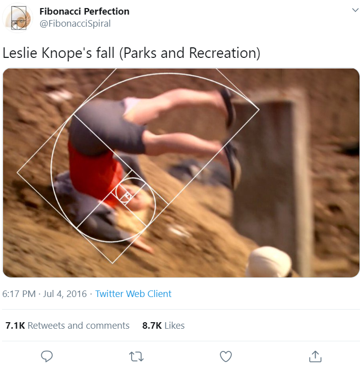
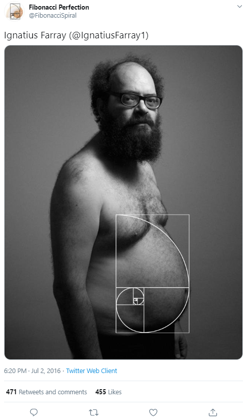

# Belle Spotter

     
    <i>Finding beauty in chaos using Golden Ratio.</i>

## Introduction

It is said that the human face is based on Phi and Golden Ratio proportions and abounds with examples of the Golden Ratio, also known as the Golden Section or Divine Proportion. Beauty is not only in the eye of the beholder but also in the relationship of the eyes and mouth of the beholden. The distance between a woman’s eyes and the distance between her eyes and her mouth are key factors in determining how attractive she is to others, according to new psychology research from the University of California, San Diego and the University of Toronto.

Using the existing studies, this project was created for Jaipur's biggest cultural fest Manipal University Jaipur organizes, called, Oneiros.

It all started with &mdash; **what if** we set-up a camera in the event where anyone can participate by facing the camera and can get rated, registering their scores on a wall.

### Acknowledgments

I read articles, I found sample snippets, combined all of them to build something unique.

**DON'T PLAGIARIZE** _for fuck's sake!_

The point I'm trying to make is, use your imagination to build upon this project. I have some wild ideas to share &mdash;

#### Wild Ideas

- Integrate the belle-spotter on a drone or a robot i.e. rate me robot
- Make an android app which can be to scan faces
- Make a web-app that can be used to hold a contest?

### Paradox

A 5x3 index card, for example, meets the Golden Ratio standard.

There's no scientific discovery that's ever followed from any kind of scientific application of the 'Golden Ratio'. It doesn't predict anything. It isn't at the base of any sort of argument that has some kind of scientific content.

> Leonardo da Vinci's illustrations of polyhedra in Divina proportione have led some to speculate that he incorporated the golden ratio in his paintings. But the suggestion that his Mona Lisa, for example, employs golden ratio proportions, is **not** supported by Leonardo's own writings. Similarly, although the Vitruvian Man is often shown in connection with the golden ratio, the proportions of the figure do not actually match it, and the text only mentions whole number ratios.
> 
> The psychologist Adolf Zeising noted that the golden ratio appeared in phyllotaxis and argued from these patterns in nature that the golden ratio was a universal law. Zeising wrote in 1854 of a universal orthogenetic law of "striving for beauty and completeness in the realms of both nature and art".
> 
> In 2010, the journal Science reported that the golden ratio is present at the atomic scale in the magnetic resonance of spins in cobalt niobate crystals. However, some have argued that many apparent manifestations of the golden ratio in nature, especially in regard to animal dimensions, are fictitious. &mdash; [Wikipedia](https://en.wikipedia.org/wiki/Golden_ratio)

A mathematical quirk, with no relationship to any objective beauty standard &mdash; unless you happen to find it visually pleasing.

One way you can use the Golden Ratio is to draw a spiral shape within a rectangle. That shape is sometimes superimposed on images along with the claim that they are somehow "aesthetically perfect". The parody Twitter account "[Fibonacci Perfection](https://twitter.com/FibonacciSpiral)" superimposes the golden rectangle on absurd situations, revealing how aesthetically imperfect supposed "golden" images often are.

Individual people _vary wildly_ in terms of beauty standards &mdash; so much so that unless you cherry-pick studies it's hard to make much sense at all of the available science on what makes people more or less attractive. There is certainly no evidence that a particular mathematically-derived lip shape or eyebrow-archness is somehow a key toward unlocking a universal human beauty response.

#### References

- [Phi: The Golden Ratio](https://www.livescience.com/37704-phi-golden-ratio.html)